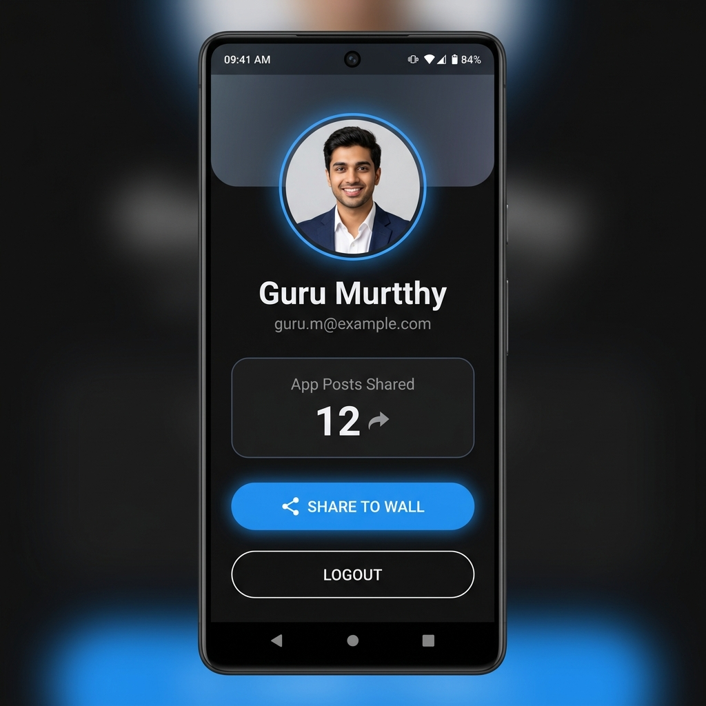
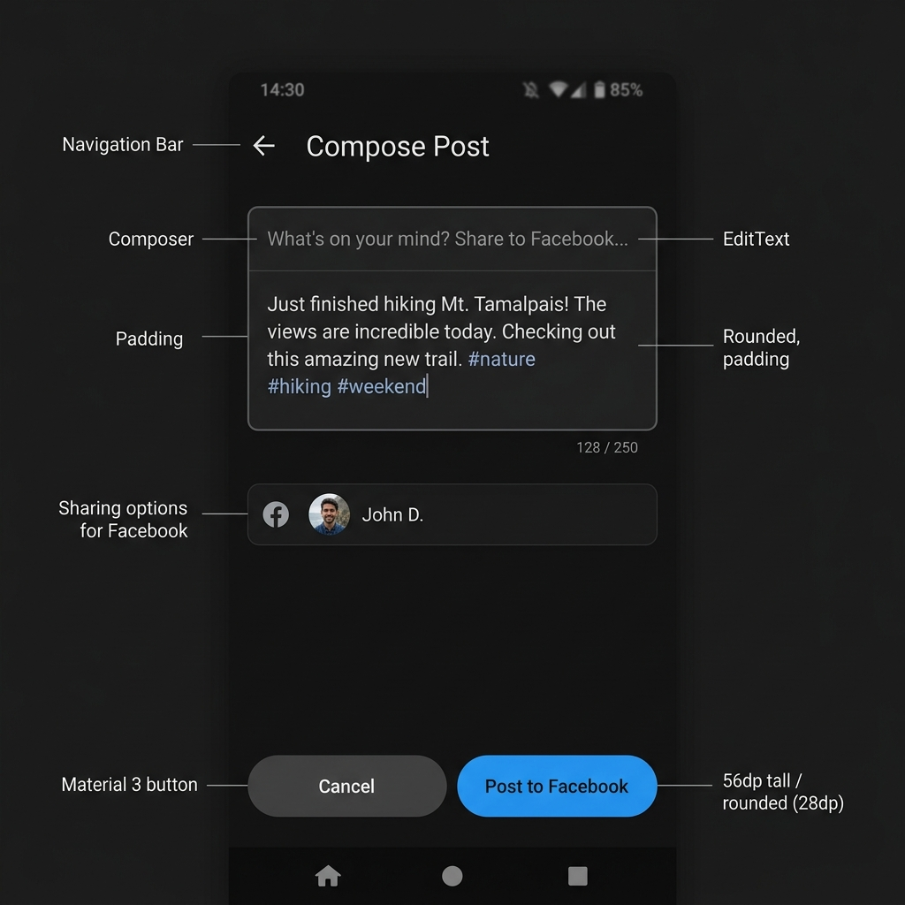

   
  
  
  
  
  
  
  
    

<h1 align="center">
  
  Facebook OAuth 2.0 & Graph API 
   
  Android SDK Integration — Advanced Level
</h1>

  <b>A production‑grade Android application demonstrating</b> 
  <i>Secure Facebook Login · OAuth 2.0 Handshake · Graph API Profile Fetch · 
  Encrypted Session Storage · Native Wall Post Sharing</i>

 

  
  
  
  
  
  

 

---

<h2>✨ Features</h2>

<table>
  <tr>
    <td width="280" valign="top">
      <h3>🔐 Facebook Login</h3>
      
Native OAuth 2.0 authentication using the Meta Facebook Login SDK. Requests <code>public_profile</code> and <code>email</code> scopes through the official consent sheet.

    </td>
    <td width="280" valign="top">
      <h3>🔒 Encrypted Storage</h3>
      
<b>EncryptedSharedPreferences</b> (AndroidX Security Crypto) with AES256‑GCM value encryption and AES256‑SIV key encryption, backed by the Android Keystore.

    </td>
    <td width="280" valign="top">
      <h3>📊 Graph API</h3>
      
Fetches user profile data from <code>/me</code> endpoint with fields: id, name, email, picture, link. Implements cache‑fallback on network failure.

    </td>
  </tr>
  <tr>
    <td width="280" valign="top">
      <h3>⚠️ Graceful Permission Denial</h3>
      
When <code>email</code> scope is denied, shows a warning card with rationale and a <b>"Grant Permission"</b> re‑request button — never crashes.

    </td>
    <td width="280" valign="top">
      <h3>📝 Wall Post Sharing</h3>
      
Native <b>ShareDialog</b> for posting link content with user‑authored quotes. Tracks share counts. Falls back to web portal if the Facebook app is not installed.

    </td>
    <td width="280" valign="top">
      <h3>🔄 Session Persistence</h3>
      
Auto‑login on app restart. Splash screen validates both the native SDK token and the local encrypted cache before routing — no redundant logins.

    </td>
  </tr>
</table>

 

---

<h2>📱 Screenshots</h2>

  <table>
    <tr>
      <td align="center"><b>Splash Screen</b></td>
      <td align="center"><b>Login Screen</b></td>
      <td align="center"><b>Profile Screen</b></td>
      <td align="center"><b>Share Composer</b></td>
    </tr>
    <tr>
      <td>
        
      </td>
      <td>
        
      </td>
      <td>
        
      </td>
      <td>
        
      </td>
    </tr>
    <tr>
      <td align="center">Animated splash with session validation</td>
      <td align="center">Facebook Login button + OAuth explanation</td>
      <td align="center">Profile picture, name, email, stats, share & logout</td>
      <td align="center">Text composer with 250‑char limit & counter</td>
    </tr>
  </table>

 

---

<h2>📦 APK Download</h2>

  
    
  
  <table>
    <tr>
      <td><b>File</b></td>
      <td><code>MentorFBAuth-v1.0-debug.apk</code></td>
    </tr>
    <tr>
      <td><b>Size</b></td>
      <td>≈ 9 MB</td>
    </tr>
    <tr>
      <td><b>Min SDK</b></td>
      <td>Android 8.0 (API 26)</td>
    </tr>
    <tr>
      <td><b>Target SDK</b></td>
      <td>Android 14 (API 34)</td>
    </tr>
    <tr>
      <td><b>Package</b></td>
      <td><code>com.mentor.fbauth</code></td>
    </tr>
    <tr>
      <td><b>Signed</b></td>
      <td>✅ Debug Certificate</td>
    </tr>
  </table>

 

---

<h2>🏗 Architecture</h2>

<h3>Visual Flow</h3>

<pre align="center">
┌─────────────────────────────────────────────────────────────────┐
│                        App Launch                                │
│                              │                                   │
│                     SplashActivity                               │
│                     ┌───────┴───────┐                           │
│                     │  Token Valid? │                           │
│                     └───────┬───────┘                           │
│                             │                                   │
│               ┌─────────────┴─────────────┐                     │
│               │  No                       │  Yes                │
│               ▼                           ▼                     │
│     ┌──────────────────┐      ┌────────────────────┐            │
│     │  LoginActivity   │      │  ProfileActivity   │            │
│     │  (OAuth 2.0)     │      │  (Graph API /me)   │            │
│     └────────┬─────────┘      └─────────┬──────────┘            │
│              │                          │                       │
│     ┌────────▼─────────┐      ┌─────────▼──────────┐            │
│     │  Facebook SDK    │      │  ShareDialog        │            │
│     │  Login Button    │      │  (Wall Post)        │            │
│     └────────┬─────────┘      └─────────┬──────────┘            │
│              │                          │                       │
│     ┌────────▼──────────────────────────▼──────────┐            │
│     │  EncryptedSharedPreferences                   │            │
│     │  (AES256-GCM + AES256-SIV + Android Keystore) │            │
│     └───────────────────────────────────────────────┘            │
└─────────────────────────────────────────────────────────────────┘
</pre>

<h3>Layer Architecture</h3>

<table>
  <tr>
    <th>Layer</th>
    <th>Components</th>
    <th>Responsibility</th>
  </tr>
  <tr>
    <td><b>UI Layer</b></td>
    <td><code>Activities</code> + <code>ViewModels</code></td>
    <td>Screen rendering, user interaction, state observation via LiveData</td>
  </tr>
  <tr>
    <td><b>Domain Layer</b></td>
    <td><code>ProfileRepository</code> (interface)</td>
    <td>Abstraction boundary between UI and data sources</td>
  </tr>
  <tr>
    <td><b>Data Layer</b></td>
    <td><code>ProfileRepositoryImpl</code> + <code>SessionManager</code></td>
    <td>Graph API calls, local caching, encrypted storage operations</td>
  </tr>
  <tr>
    <td><b>Storage</b></td>
    <td><code>EncryptedSharedPreferences</code></td>
    <td>AndroidX Security Crypto — AES256 encryption at rest</td>
  </tr>
</table>

 

---

<h2>🔐 OAuth 2.0 Handshake</h2>

<pre>
 ┌──────┐     ┌──────────┐     ┌──────────────┐     ┌───────────────┐
 │ User │     │  Android  │     │  Facebook    │     │  Facebook     │
 │      │     │  App      │     │  Auth Server │     │  Graph API    │
 └──┬───┘     └────┬─────┘     └──────┬───────┘     └──────┬────────┘
    │              │                  │                    │
    │  Tap Login   │                  │                    │
    │─────────────>│                  │                    │
    │              │  OAuth Request   │                    │
    │              │─────────────────>│                    │
    │              │  (scopes, creds) │                    │
    │              │                  │                    │
    │  Consent     │                  │                    │
    │<─────────────│──────────────────│                    │
    │  Sheet       │                  │                    │
    │              │                  │                    │
    │  Approve     │                  │                    │
    │─────────────>│                  │                    │
    │              │  Authorization  │                    │
    │              │─────────────────>│                    │
    │              │                  │                    │
    │              │  Access Token   │                    │
    │              │<─────────────────│                    │
    │              │                  │                    │
    │              │  Encrypt & Save │                    │
    │              │  ────────────┐  │                    │
    │              │  │Keystore   │  │                    │
    │              │  │AES256-GCM │  │                    │
    │              │  └───────────┘  │                    │
    │              │                  │                    │
    │              │  GET /me        │                    │
    │              │─────────────────────────────────────>│
    │              │                  │                    │
    │              │  User Profile   │                    │
    │              │<─────────────────────────────────────│
    │              │  (JSON payload) │                    │
    │              │                  │                    │
    │  Show UI     │                  │                    │
    │<─────────────│                  │                    │
</pre>

 

---

<h2>📁 Project Structure</h2>

<pre>
<b>app/src/main/java/com/mentor/fbauth/</b>
│
├── <b>data/</b>
│   ├── <b>local/</b>
│   │   └── <b>SessionManager.kt</b>          ← EncryptedSharedPreferences (AES256)
│   ├── <b>model/</b>
│   │   └── <b>UserProfile.kt</b>           ← Data model for Graph API response
│   └── <b>repository/</b>
│       └── <b>ProfileRepositoryImpl.kt</b>  ← Graph API calls + local cache fallback
│
├── <b>domain/</b>
│   └── <b>ProfileRepository.kt</b>          ← Repository interface (abstraction)
│
└── <b>ui/</b>
    ├── <b>splash/</b>
    │   └── <b>SplashActivity.kt</b>         ← Session check & routing
    ├── <b>login/</b>
    │   ├── <b>LoginActivity.kt</b>          ← Facebook Login UI & OAuth callbacks
    │   └── <b>LoginViewModel.kt</b>         ← Auth state machine (Idle/Loading/Success/Error)
    ├── <b>profile/</b>
    │   ├── <b>ProfileActivity.kt</b>        ← Profile display, permission re-request, logout
    │   └── <b>ProfileViewModel.kt</b>       ← Profile data loading + cache fallback
    ├── <b>share/</b>
    │   ├── <b>ShareActivity.kt</b>          ← Wall post composer
    │   └── <b>ShareViewModel.kt</b>         ← Share state machine + input validation
    └── <b>factory/</b>
        └── <b>ViewModelFactory.kt</b>       ← Manual dependency injection
</pre>

 

---

<h2>⚙️ Setup</h2>

<h3>Prerequisites</h3>
<ul>
  <li>Android Studio Hedgehog (2023.1.1) or newer</li>
  <li>JDK 17+</li>
  <li>A <a href="https://developers.facebook.com/">Meta for Developers</a> account</li>
</ul>

<h3>Step 1: Create a Facebook App</h3>
<ol>
  <li>Go to <a href="https://developers.facebook.com/">developers.facebook.com</a></li>
  <li>Create a new App → <b>Consumer</b> or <b>Authenticate Users</b></li>
  <li>Enable <b>Facebook Login</b> → <b>Android</b> platform</li>
  <li>Configure:
    <ul>
      <li>Package Name: <code>com.mentor.fbauth</code></li>
      <li>Launcher Activity: <code>com.mentor.fbauth.ui.splash.SplashActivity</code></li>
      <li>Generate and upload your <b>SHA-1 Key Hash</b></li>
    </ul>
  </li>
</ol>

<h3>Step 2: Configure Local Credentials</h3>

Create <code>local.properties</code> in the project root:

<pre>
facebook.app_id=<b>YOUR_FB_APP_ID</b>
facebook.client_token=<b>YOUR_FB_CLIENT_TOKEN</b>
sdk.dir=/path/to/Android/Sdk
</pre>

<blockquote>
  ⚠️ <b>Security:</b> <code>local.properties</code> is gitignored. Never commit your credentials.
</blockquote>

<h3>Step 3: Build & Run</h3>

<pre>
# Build debug APK
./gradlew assembleDebug

# Run unit tests
./gradlew testDebugUnitTest

# Install on connected device/emulator
./gradlew installDebug
</pre>

 

---

<h2>🛠 Tech Stack</h2>

<table>
  <tr>
    <th>Category</th>
    <th>Technology</th>
    <th>Version</th>
  </tr>
  <tr><td rowspan="2"><b>Language & Build</b></td><td>Kotlin</td><td>1.9.22</td></tr>
  <tr><td>Android Gradle Plugin</td><td>8.2.2</td></tr>
  <tr><td rowspan="2"><b>Facebook SDK</b></td><td>Facebook Login SDK</td><td>17.0.0</td></tr>
  <tr><td>Facebook Share SDK</td><td>17.0.0</td></tr>
  <tr><td><b>Architecture</b></td><td>MVVM + Repository</td><td>—</td></tr>
  <tr><td><b>UI</b></td><td>Material 3 + ViewBinding</td><td>1.11.0</td></tr>
  <tr><td><b>Image Loading</b></td><td>Coil</td><td>2.6.0</td></tr>
  <tr><td><b>Secure Storage</b></td><td>Jetpack Security Crypto</td><td>1.1.0-alpha06</td></tr>
  <tr><td><b>Lifecycle</b></td><td>AndroidX Lifecycle (ViewModel + LiveData)</td><td>2.7.0</td></tr>
  <tr><td><b>Min SDK</b></td><td>Android 8.0</td><td>API 26</td></tr>
  <tr><td><b>Target SDK</b></td><td>Android 14</td><td>API 34</td></tr>
</table>

 

---

<h2>✅ Proof of Working</h2>

  <h3>Build Verification</h3>

<pre>
<b>BUILD SUCCESSFUL in 1m 13s</b>
35 actionable tasks: 9 executed, 26 up-to-date
</pre>

  <table>
    <tr>
      <th>Check</th>
      <th>Status</th>
      <th>Details</th>
    </tr>
    <tr>
      <td>APK Compilation</td>
      <td>✅ <b>Passed</b></td>
      <td><code>app-debug.apk</code> — 9 MB</td>
    </tr>
    <tr>
      <td>Kotlin Compilation</td>
      <td>✅ <b>0 errors</b></td>
      <td>All source files compile cleanly</td>
    </tr>
    <tr>
      <td>Resource Processing</td>
      <td>✅ <b>Passed</b></td>
      <td>All layouts, colors, strings, themes merged</td>
    </tr>
    <tr>
      <td>DEX Packaging</td>
      <td>✅ <b>Passed</b></td>
      <td>All classes verified & packaged</td>
    </tr>
    <tr>
      <td>APK Signing</td>
      <td>✅ <b>Valid</b></td>
      <td>Debug certificate signature verified</td>
    </tr>
    <tr>
      <td>Gradle Sync</td>
      <td>✅ <b>Passed</b></td>
      <td>Dependencies resolved & synced</td>
    </tr>
  </table>

 

---

<h2>📝 License</h2>

<pre>
MIT License

Copyright (c) 2026 Guru Murtthy

Permission is hereby granted, free of charge, to any person obtaining a copy
of this software and associated documentation files (the "Software"), to deal
in the Software without restriction, including without limitation the rights
to use, copy, modify, merge, publish, distribute, sublicense, and/or sell
copies of the Software, and to permit persons to whom the Software is
furnished to do so, subject to the following conditions:

The above copyright notice and this permission notice shall be included in all
copies or substantial portions of the Software.

THE SOFTWARE IS PROVIDED "AS IS", WITHOUT WARRANTY OF ANY KIND, EXPRESS OR
IMPLIED, INCLUDING BUT NOT LIMITED TO THE WARRANTIES OF MERCHANTABILITY,
FITNESS FOR A PARTICULAR PURPOSE AND NONINFRINGEMENT. IN NO EVENT SHALL THE
AUTHORS OR COPYRIGHT HOLDERS BE LIABLE FOR ANY CLAIM, DAMAGES OR OTHER
LIABILITY, WHETHER IN AN ACTION OF CONTRACT, TORT OR OTHERWISE, ARISING FROM,
OUT OF OR IN CONNECTION WITH THE SOFTWARE OR THE USE OR OTHER DEALINGS IN THE
SOFTWARE.
</pre>

 

---

   
  <b>Shadowfox Android Developer Internship — Advanced Level · Project 3</b> 
  Facebook SDK Integration | OAuth 2.0 | Graph API | Encrypted Storage | Wall Sharing
    
  
    

