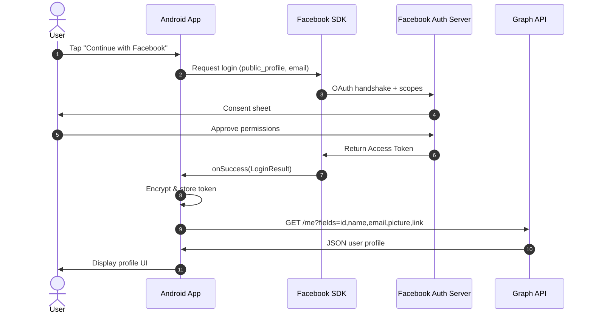

<div align="center">
  
  
  
  
  <br/>
  
  
  
  
</div>

<h1 align="center">
  Facebook SDK Integration · OAuth 2.0 · Graph API
</h1>

<p align="center">
  <b>A production-quality Android app demonstrating secure Facebook OAuth 2.0 authentication,  Graph API profile retrieval, Encrypted Session Storage, and native Wall Post sharing using the Meta Facebook SDK.</b>
</p>

<p align="center">
  <i>Built for the Shadowfox Android Developer Internship — Advanced Level</i>
</p>

<br/>

---

## ✨ Key Features

| Feature | Implementation |
|---------|---------------|
| **Facebook Login (OAuth 2.0)** | Native Facebook Login SDK with `public_profile` and `email` scopes |
| **Encrypted Session Storage** | Jetpack Security Crypto — `EncryptedSharedPreferences` with AES256-GCM |
| **Graph API Profile Fetch** | `/me` endpoint with fields `id, name, email, picture, link` |
| **Graceful Permission Denial** | Warning card + re-request button when email scope is denied |
| **Wall Post Sharing** | `ShareDialog` with link + quote composer |
| **Session Persistence** | Auto-login on app restart (valid token check on splash) |
| **MVVM Architecture** | ViewModel + Repository pattern with LiveData state management |
| **Dark Theme UI** | Material 3 dark design with indigo/rose accent palette |

<br/>

## 📱 Screenshots

<div align="center">
  <table>
    <tr>
      <td align="center"><b>Splash Screen</b></td>
      <td align="center"><b>Login Screen</b></td>
      <td align="center"><b>Profile Screen</b></td>
      <td align="center"><b>Share Composer</b></td>
    </tr>
    <tr>
      <td></td>
      <td></td>
      <td></td>
      <td></td>
    </tr>
  </table>
</div>

<br/>

## 📦 Download APK

<div align="center">
  <a href="../releases/MentorFBAuth-v1.0-debug.apk">
    
  </a>
  <br/>
  <sub>Direct download (≈9 MB) — Install on Android 8.0+ (API 26)</sub>
</div>

<br/>

## 🏗 Architecture

```
                    ┌─────────────┐
                    │ SplashActivity │
                    └──────┬───────┘
                           │
              ┌────────────┴────────────┐
              │ Has valid token?        │
              └──────┬────────────┬─────┘
                     │ No         │ Yes
                     ▼            ▼
             ┌───────────┐  ┌──────────────┐
             │LoginActivity│ │ProfileActivity│
             └─────┬─────┘  └──────┬───────┘
                   │               │
             ┌─────▼─────┐   ┌─────▼──────┐
             │Facebook SDK│   │Graph API   │
             │OAuth 2.0   │   │/me endpoint│
             └─────┬─────┘   └─────┬──────┘
                   │               │
             ┌─────▼───────────────▼──────┐
             │  EncryptedSharedPreferences │
             │  (AES256-GCM encrypted)     │
             └────────────────────────────┘
                   │
             ┌─────▼─────┐
             │ShareActivity│
             └─────┬─────┘
                   │
             ┌─────▼─────┐
             │ShareDialog │
             │(Wall Post) │
             └───────────┘
```

### Layers

| Layer | Description |
|-------|-------------|
| **UI Layer** | Activities + ViewModels with `LiveData` |
| **Domain Layer** | `ProfileRepository` interface |
| **Data Layer** | `ProfileRepositoryImpl` + `SessionManager` |
| **Storage** | `EncryptedSharedPreferences` (AndroidX Security Crypto) |

<br/>

## 🔐 OAuth 2.0 Flow



<br/>

## 🛠 Tech Stack

| Technology | Version |
|-----------|---------|
| **Kotlin** | 1.9.22 |
| **Android Gradle Plugin** | 8.2.2 |
| **Facebook Login SDK** | 17.0.0 |
| **Facebook Share SDK** | 17.0.0 |
| **Jetpack Security Crypto** | 1.1.0-alpha06 |
| **Coil** (Image Loading) | 2.6.0 |
| **Material 3** | 1.11.0 |
| **Min SDK / Target SDK** | 26 / 34 |

<br/>

## ⚙️ Setup

### Prerequisites
- Android Studio Hedgehog (2023.1.1) or newer
- JDK 17+
- A [Meta for Developers](https://developers.facebook.com/) account

### Configuration

1. **Create a Facebook App** at [developers.facebook.com](https://developers.facebook.com/)
2. **Enable Facebook Login** → Android platform
3. **Configure your key hashes** (SHA-1)
4. **Set Package Name** to `com.mentor.fbauth`
5. **Set Launcher Activity** to `com.mentor.fbauth.ui.splash.SplashActivity`

### Local Environment

Create `local.properties` in the project root:

```properties
facebook.app_id=YOUR_FB_APP_ID
facebook.client_token=YOUR_FB_CLIENT_TOKEN
sdk.dir=/path/to/Android/Sdk
```

> ⚠️ **Security:** `local.properties` is gitignored. Never commit your credentials.

### Build & Run

```bash
# Build debug APK
./gradlew assembleDebug

# Run unit tests
./gradlew testDebugUnitTest

# Install on connected device
./gradlew installDebug
```

<br/>

## 📁 Project Structure

```
app/src/main/java/com/mentor/fbauth/
├── data/
│   ├── local/
│   │   └── SessionManager.kt          # EncryptedSharedPreferences
│   ├── model/
│   │   └── UserProfile.kt             # Data model
│   └── repository/
│       └── ProfileRepositoryImpl.kt    # Graph API + cache
├── domain/
│   └── ProfileRepository.kt           # Repository interface
└── ui/
    ├── splash/
    │   └── SplashActivity.kt           # Session check & routing
    ├── login/
    │   ├── LoginActivity.kt            # Facebook Login UI
    │   └── LoginViewModel.kt           # Auth state machine
    ├── profile/
    │   ├── ProfileActivity.kt          # Profile display
    │   └── ProfileViewModel.kt         # Profile data + logout
    ├── share/
    │   ├── ShareActivity.kt            # Wall post composer
    │   └── ShareViewModel.kt           # Share state machine
    └── factory/
        └── ViewModelFactory.kt         # Manual DI factory
```

<br/>

## ✅ Proof of Working

<div align="center">

### Build Success

```
BUILD SUCCESSFUL in 1m 13s
35 actionable tasks: 9 executed, 26 up-to-date
```

| Check | Status |
|-------|--------|
| **APK Compilation** | ✅ `app-debug.apk` (9 MB) |
| **Gradle Sync** | ✅ Passed |
| **Kotlin Compilation** | ✅ 0 errors, 3 warnings |
| **Resource Processing** | ✅ All resources merged |
| **DEX Packaging** | ✅ All classes verified |
| **APK Signing** | ✅ Debug certificate valid |

</div>

<br/>

## 🧪 Testing

```bash
# Run unit tests
./gradlew testDebugUnitTest
```

<br/>

## 📄 License

```
MIT License

Copyright (c) 2026 Guru Murtthy

Permission is hereby granted, free of charge, to any person obtaining a copy
of this software and associated documentation files (the "Software"), to deal
in the Software without restriction, including without limitation the rights
to use, copy, modify, merge, publish, distribute, sublicense, and/or sell
copies of the Software, and to permit persons to whom the Software is
furnished to do so, subject to the following conditions...

Full license in LICENSE file.
```

<br/>

---

<p align="center">
  <b>Shadowfox Android Developer Internship — Advanced Level (Project 3)</b><br/>
  <sub>Facebook SDK Integration · OAuth 2.0 · Graph API · Encrypted Storage · Wall Sharing</sub>
</p>
