# Advanced Facebook SDK Integration, OAuth 2.0 & Graph API (Android)

This repository contains a production-quality Android application demonstrating standard integrations of the **Facebook SDK**, secure **OAuth 2.0 authentication flows**, **Graph API profile retrieval**, and **Wall post sharing dialogs**. Built as part of a senior-level mentorship internship project.

---

## 🚀 Key Features

### 🔐 1. Facebook Login (OAuth 2.0)
* Implemented the native Facebook Login SDK flow.
* Handles the complete OAuth 2.0 handshake under the hood, securely capturing authorization tokens.
* Configured requested scopes for `public_profile` and `email`.

### 💾 2. Secure Session Storage
* Integrates AndroidX Security Crypto's **`EncryptedSharedPreferences`**.
* Encrypts authorization tokens (`AES256_SIV` for keys, `AES256_GCM` for values) on disk to prevent token leaks on rooted or backed-up devices.
* Restores sessions on app relaunch without prompting the user to re-authenticate (session persistence).

### 📊 3. Graph API Fetch & Fallbacks
* Queries the `/me` user node using **`GraphRequest`** with specified parameters (`id, name, email, picture, link`).
* Implements a **cache-fallback pattern**: displays local data from encrypted storage if the network drops.
* Gracefully handles **Permission Denial**: if a user denies the `email` scope:
  - Renders a warning card banner.
  - Dynamically displays a fallback message (`[Not Provided - Permission Denied]`) rather than crashing.
  - Adds a rationale button that allows the user to re-grant the permission dynamically.

### 📝 4. Wall Post sharing
* Triggers Facebook's native **`ShareDialog`** to publish link content and quotes.
* Captures posting success/cancellation callbacks from the SDK.
* Tracks and increments shared post metrics inside the app.

---

## 🛠 Tech Stack & Architecture

* **Language**: Kotlin
* **Design Pattern**: MVVM (Model-View-ViewModel) + Repository Abstraction
* **UI Framework**: Material 3 + ViewBinding (Dark-Theme Aesthetics)
* **Storage**: EncryptedSharedPreferences (Jetpack Security Crypto)
* **Image Loading**: Coil (Kotlin-first image loading)
* **API Engine**: Meta Android Facebook SDK

---

## 📐 OAuth 2.0 Handshake Workflow

```mermaid
sequenceDiagram
    autonumber
    actor User as User Device
    participant App as Android Client App
    participant SDK as Meta Facebook Login SDK
    participant AuthServer as Facebook Auth Server (OAuth 2.0)
    participant GraphAPI as Facebook Graph API Server

    User->>App: Launch App & Tap "Continue with Facebook"
    App->>SDK: Request login (scopes: public_profile, email)
    SDK->>AuthServer: OAuth Handshake (Client Credentials + Scopes)
    AuthServer->>User: Displays consent sheet (Approve / Deny scopes)
    User->>AuthServer: Grant/Deny permission approvals
    AuthServer->>SDK: Exchange credentials & return Access Token
    SDK->>App: Deliver Token in onSuccess(LoginResult)
    App->>App: Encrypt & cache token in EncryptedSharedPreferences
    
    rect rgb(30, 41, 59)
        note right of App: Graph API Profile Loading
        App->>GraphAPI: GET /me?fields=id,name,email,picture,link with Bearer Token
        GraphAPI->>App: Returns JSON payload
        App->>User: Renders profile picture & data (or shows email fallback)
    end
```



---

## ⚙️ Configuration & Setup

To run this project locally or review it:

### 1. Developer Portal Setup
1. Register an account on [Meta for Developers Portal](https://developers.facebook.com/).
2. Create a new App (select **Consumer** or **Authenticate Users**).
3. Under **Facebook Login** -> **Quickstart** -> **Android**:
   * Set Package Name to: `com.mentor.fbauth`
   * Set Launcher Activity to: `com.mentor.fbauth.ui.splash.SplashActivity`
   * Generate and upload your debug/release **SHA-1 Key Hash**.

### 2. Local Environment Setup
Before building the project, create or open your local environment configuration at `/local.properties` and add your credentials:
```properties
facebook.app_id=YOUR_FB_APP_ID
facebook.client_token=YOUR_FB_CLIENT_TOKEN
```
*(The `.gitignore` configuration in this repository prevents these credentials from being pushed to public source control).*

### 3. Open & Build
1. Open Android Studio and import the repository.
2. Click **Sync Project with Gradle Files**.
3. Compile and run the project on your emulator or connected device.
